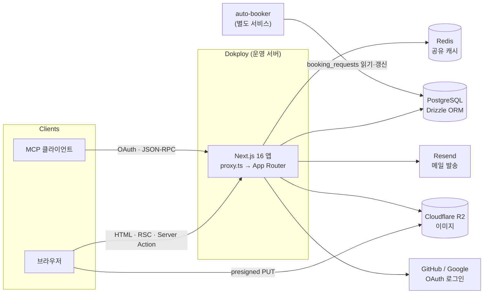
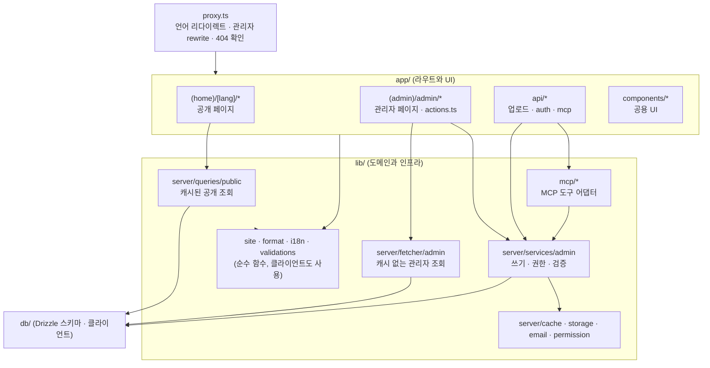
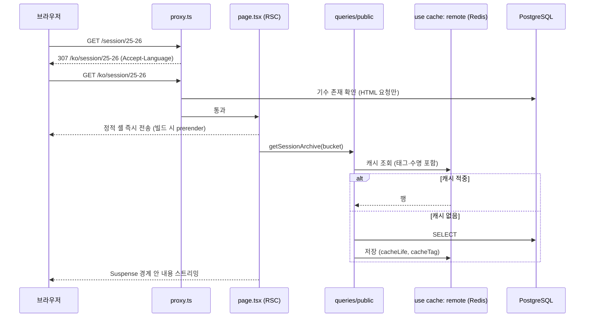
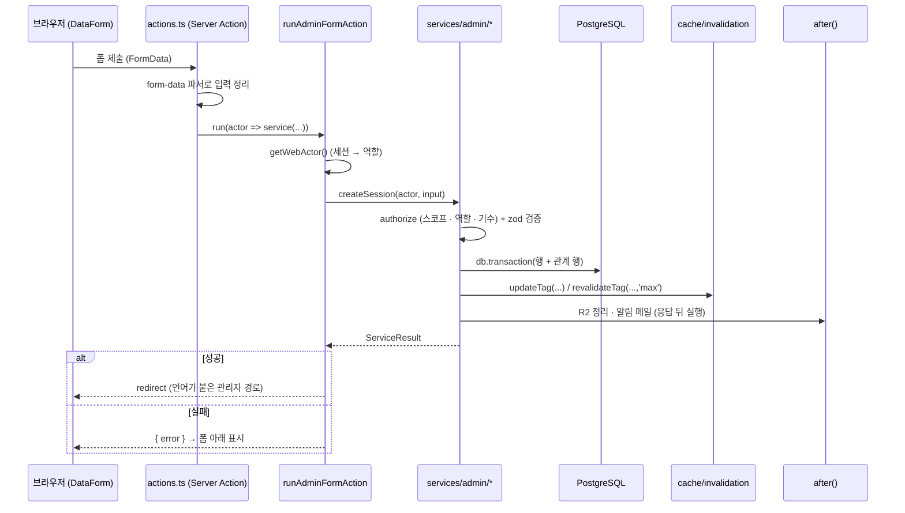
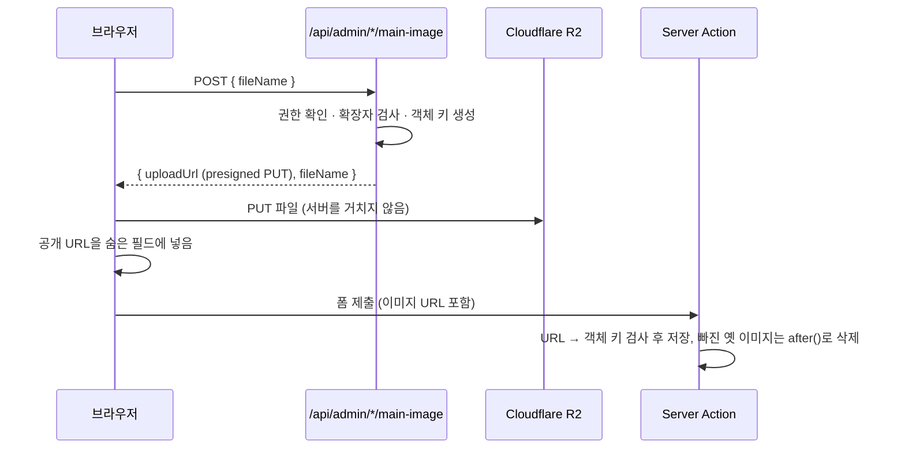
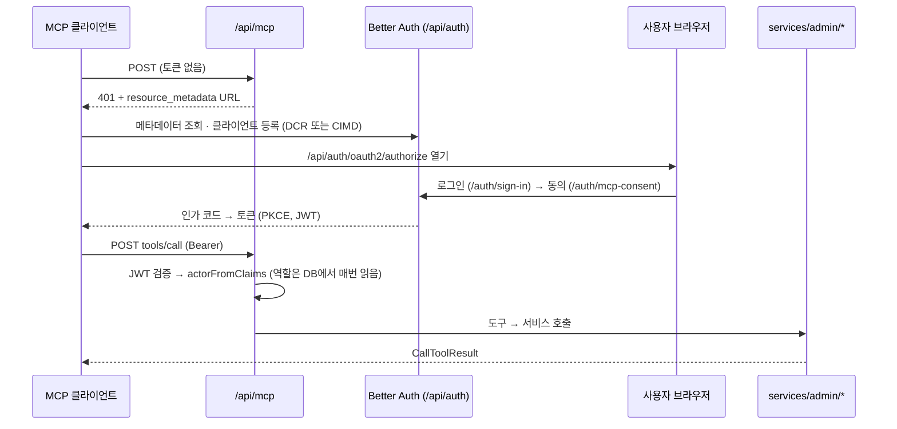

# 시스템 아키텍처 개요

GDGoC Yonsei 웹은 하나의 Next.js 16 앱 안에 세 가지 제품을 담고 있다.

| 제품                | 경로                                   | 사용자                           | 성격                                                 |
| ------------------- | -------------------------------------- | -------------------------------- | ---------------------------------------------------- |
| 공개 사이트         | `/{en,ko}/...`                         | 누구나                           | 세션·프로젝트·멤버 기록, 캘린더. 캐시된 정적 셸 위주 |
| GYMS(관리자 시스템) | `/admin/...` (`/ko/admin`도 같은 화면) | 동아리 멤버                      | 로그인 필요, 역할별 권한, 캐시하지 않음              |
| GYMS MCP            | `/api/mcp`                             | MCP 클라이언트(Claude, Codex 등) | OAuth 2.1 토큰, 관리자 기능을 도구로 노출            |

세 제품은 같은 DB와 같은 서비스 계층을 공유한다. 관리자 화면과 MCP는 "얇은 어댑터"이고, 권한·검증·캐시
무효화 같은 규칙은 `lib/server/services/admin/*` 한 곳에 있다.

관련 문서

- 코드 배치와 작성 규칙: [`code-organization.md`](./code-organization.md)
- 인증과 권한: [`auth-and-permissions.md`](./auth-and-permissions.md)
- 캐시와 무효화: [`caching.md`](./caching.md)
- 이미지 업로드: [`uploads.md`](./uploads.md)
- MCP 서버: [`mcp.md`](./mcp.md)
- CI/CD와 배포: [`ci-cd.md`](./ci-cd.md)
- 개발 환경: [`../development.md`](../development.md), 인수인계 메모: [`../handoff.md`](../handoff.md)

## 1. 시스템 구성



- **PostgreSQL**: 모든 데이터. 스키마는 `db/schema/*`, 마이그레이션은 `drizzle/`.
- **Redis**: `REDIS_URL`이 있으면 Next 캐시(`use cache: remote`, ISR)를 인스턴스 간에 공유한다. 없으면 메모리 캐시.
- **Cloudflare R2**: 세션·프로젝트·프로필 이미지. 브라우저가 presigned URL로 직접 올린다.
- **Resend**: 세션 생성 알림 메일(응답 뒤 `after()`로 보냄).
- **auto-booker**: 연세대 공간 대관을 자동으로 신청하는 별도 서비스. 같은 DB의 `booking_requests` 테이블을 함께 쓴다.

## 2. 계층 구조



의존 방향은 `app → lib → db` 한쪽이다. `lib/`와 `db/`가 `@/app/*`를 import하면 ESLint가 오류를 낸다
(`eslint.config.mjs`). 클라이언트 컴포넌트는 `server-only` 모듈과 DB를 import할 수 없다.

## 3. 요청 흐름

### 3-1. 공개 페이지 (캐시)



- `cacheComponents: true`라서 페이지 셸은 빌드 때 미리 만들고, 데이터 부분은 Suspense로 스트리밍한다.
- 공개 조회는 두 언어 값을 한 번에 읽어 캐시하므로 캐시 키에 언어가 없다. 태그는 언어별로 붙는다.
- 세션은 "공개 시각"을 한 시간 단위 버킷으로 캐시 키에 넣어, 시간이 지나 공개되는 세션이 한 시간 안에 보이게 한다.
- 존재하지 않는 기수·상세는 proxy가 DB로 먼저 확인해 진짜 404 상태 코드를 돌려준다(스트리밍 중에는 상태 코드를 바꿀 수 없다).

### 3-2. 관리자 쓰기 (내가 쓴 내용을 바로 보기)



- 서비스는 `Actor`를 인자로 받는다. 쿠키나 헤더를 직접 읽지 않으므로 MCP에서도 그대로 쓴다.
- `updateTag`는 Server Action에서만 동작한다. MCP 라우트에서는 같은 무효화 함수가 `revalidateTag(tag, { expire: 0 })`로 바뀐다(`invalidation-context.ts`).
- DB 트랜잭션이 커밋된 뒤에 외부 작업(R2 삭제, 메일)을 `after()`로 실행한다. 트랜잭션이 롤백되면 외부 작업도 일어나지 않는다.

### 3-3. 이미지 업로드



MCP 업로드(최대 200MB, 외부 URL 가져오기)는 다른 경로를 쓴다. 자세한 내용은 [`uploads.md`](./uploads.md).

### 3-4. MCP OAuth



## 4. 디렉터리 지도

```text
proxy.ts                 요청 전처리(언어 리다이렉트, 관리자 rewrite, 404)
auth.ts                  Better Auth 설정(로그인, 패스키, MCP OAuth 인가 서버)
next.config.ts           cacheComponents, cacheLife 프로필, Redis 캐시 핸들러, 이미지 설정
app/
  (home)/[lang]/         공개 사이트(홈, 세션, 프로젝트, 멤버, 캘린더, 약관)
    _components/home/    홈 섹션과 스크롤 연출(anime.js, WebGL)
  (admin)/admin/         관리자 화면. 리소스별 page/layout/actions/*-table
  (admin)/auth/          로그인, MCP 동의 화면
  api/                   업로드 presign, Better Auth, MCP, 디스커버리 라우트
  components/            공용 UI(admin/, site/, header/, auth/, svg/)
  styles/                공개 사이트 CSS(site-*.css)
lib/
  server/
    services/admin/      쓰기 서비스(권한·검증·트랜잭션·무효화). 웹과 MCP가 공유
    queries/public/      공개 조회(use cache: remote)
    fetcher/admin/       관리자 조회(캐시 없음)
    cache/               태그, 수명, 무효화, Redis 핸들러(.cjs)
    permission/          역할별 권한 표(policy.ts)와 가드
    storage/             R2 접근(이 폴더만 R2를 직접 만진다)
    uploads/             MCP 업로드(매직 바이트, SSRF 방어, 한도, 토큰)
    booking/             강의실 대관(정책, 저장소, 상태 동기화)
    actions/, form-data/ Server Action 공통 실행기와 FormData 파서
    env.ts, env-core.ts  환경 변수 검증
  mcp/                   MCP 서버, 도구, 감사 로그, 동의 화면 로직
  site/                  공개 사이트 도메인 로직(순수 함수: 경로, 필터, 세션 로그, JSON-LD …)
  format/, i18n/         날짜·이름 포매터, 언어 유틸
  admin-i18n/            관리자 화면 사전(en/ko)
  contents/              공개 사이트 문구(두 언어)
  validations/           zod 입력 스키마
  seo/                   메타데이터, 사이트맵, 소셜 이미지
db/                      Drizzle 클라이언트와 스키마
drizzle/                 SQL 마이그레이션(수정 금지, 새로 추가만)
emails/                  React Email 템플릿
scripts/                 CI 검사, 배포, 성능 측정, 시드
tests/                   Vitest 단위·컴포넌트 테스트(tests/e2e는 Playwright 시나리오)
```

## 5. 이전 설계 기록

`docs/superpowers/`의 명세(specs)와 계획(plans)은 디자인 개편, 랜딩 연출, MCP 도입 당시의 결정 기록이다.
현재 코드와 다른 부분이 있을 수 있으므로 "왜 이렇게 만들었는지"를 볼 때만 참고하고, 현재 동작은 이 문서와
코드를 기준으로 한다.

- 디자인 시스템 "Inside the Brackets": `docs/superpowers/specs/2026-09-23-inside-the-brackets-redesign-design.md`
- 랜딩 스크롤 연출: `docs/superpowers/specs/2026-09-25-landing-motion-design.md`
- GYMS MCP: `docs/superpowers/specs/2026-09-27-gyms-mcp-design.md`
- 성능 측정 기록: `docs/performance/nextjs-16.3-performance.md`
