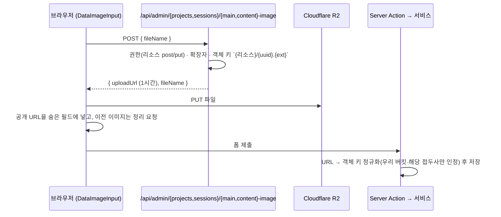

# 이미지 업로드

이미지는 Cloudflare R2(S3 호환)에 저장하고, DB에는 **공개 URL**을 저장한다.
공개 URL은 `NEXT_PUBLIC_IMAGE_URL` + 객체 키(`projects/{uuid}.png` 같은 모양)다.

| 모듈                                  | 역할                                                                         |
| ------------------------------------- | ---------------------------------------------------------------------------- |
| `lib/server/storage/r2.ts`            | R2를 직접 다루는 **유일한** 모듈: presigned URL, 조회, 삭제, 스트리밍 업로드 |
| `lib/server/storage/r2-client.ts`     | S3 클라이언트 싱글턴(테스트에서 가로채기 쉽게 분리)                          |
| `lib/server/storage/object-key.ts`    | 공개 URL ↔ 객체 키 변환, 경로 조작·확장자·리소스 접두사 검사                 |
| `lib/image-url.ts`                    | 클라이언트에서도 쓰는 공개 URL 조립(슬래시 하나로 이어 붙임)                 |
| `lib/upload-image.ts`                 | 브라우저 쪽 업로드 흐름(presign 요청 → R2 PUT → 응답 검사)                   |
| `lib/server/image-upload-route.ts`    | 세션·프로젝트 presign API 라우트 팩토리                                      |
| `lib/server/services/admin/images.ts` | MCP 업로드 서비스(최대 200MB, URL 가져오기, 한도)                            |
| `lib/server/uploads/*`                | MCP 업로드 보조: 매직 바이트 판별, SSRF 방어, 업로드 기록, 완료 토큰         |

## 1. 관리자 웹 업로드

- 파일은 서버를 거치지 않는다. 서버는 서명만 한다.
- 업로드 중에는 전역 atom(`lib/admin/atoms.ts`)으로 제출 버튼을 막는다. 업로드가 끝나기 전에 제출하면 이미지가 빠진 채 저장되기 때문이다.
- 업로드에 실패하면 이전 값을 유지한다. `lib/upload-image.ts`가 응답 상태와 모양을 검사해, 오류 응답이 URL처럼 저장되는 일을 막는다.
- 프로필 이미지는 `/api/admin/members/profile-image`에서 presign을 받고, 올린 뒤 `/api/admin/members/{id}`로 URL을 저장한다(폼 제출과 별개로 즉시 반영).

### 쓰지 않게 된 이미지 정리

| 상황 | 동작                                                                                                                                                                                   |
| ---- | -------------------------------------------------------------------------------------------------------------------------------------------------------------------------------------- |
| 수정 | DB 트랜잭션이 커밋된 **뒤** 빠진 이미지를 지운다(`deleteRemovedImages`). R2는 트랜잭션에 묶을 수 없기 때문이다. 실패하면 로그만 남기고 수정은 성공으로 본다(쓰지 않는 객체가 남을 뿐). |
| 삭제 | 이미지를 **먼저** 지우고 성공하면 행을 지운다. R2 삭제가 실패하면 `R2 Image Delete Error`로 삭제를 멈춘다(고아 객체를 남기지 않기 위한 선택, 테스트가 확인).                           |

키 정규화 단계에서 외부 URL(GitHub 아바타 등)과 기본 이미지는 걸러지므로 우리 버킷의 해당 접두사 객체만 지운다.

## 2. MCP 업로드 (최대 200MB)

셸이 있는 클라이언트와 없는 클라이언트를 위해 두 경로가 있다.

### 2-1. 직접 업로드: `create_image_upload` → `complete_image_upload`

1. `create_image_upload`: 형식·크기를 받아 presigned PUT URL(15분)을 돌려준다. 서명에 `Content-Type`과 `Content-Length`가 들어가 다른 파일을 올릴 수 없다.
   함께 주는 `uploadToken`(HMAC, 1시간)은 객체 키·사용자·만료를 묶는다.
2. 클라이언트가 `curl`로 업로드한다.
3. `complete_image_upload`: 토큰을 검증하고, 실제 크기와 **매직 바이트**(`image-signature.ts`)로 형식을 확인한 뒤 공개 URL을 돌려준다. 맞지 않으면 객체를 지운다.

토큰이 있어야 완료할 수 있으므로, 이미 사이트에 있는 이미지 키나 다른 사람의 업로드를 넘겨 검증·삭제하게 만들 수 없다.

### 2-2. URL 가져오기: `import_image_from_url`

공개 https 이미지를 R2 멀티파트 업로드로 **스트리밍**한다(메모리에 다 올리지 않는다). 서버가 임의 URL에 접속하므로
SSRF 방어가 핵심이다(`lib/server/uploads/remote-fetch.ts`).

- DNS 결과가 사설·루프백·링크 로컬·IPv4 호환·6to4·NAT64·discard 대역이면 연결하지 않는다.
- 리다이렉트마다, 그리고 실제 연결 시점에 다시 확인한다(DNS rebinding 방지).
- 응답 헤더 30초, 전체 전송 10분 제한.

### 2-3. 공통 규칙

- 허용 형식: jpg, jpeg, png, webp, gif, avif. **SVG는 거부**(스크립트를 담을 수 있다).
- 생성·수정 도구의 이미지 필드에는 이 도구들이 돌려준 URL만, 그리고 맞는 접두사(`sessions/`, `projects/`, `users/`)만 받는다.
- 한도: 사용자당 시간당 100회(직접 + 가져오기, 실패·거절 포함). 사용자별 advisory lock으로 세고 넣는 일을 한 트랜잭션에서 해 동시 요청이 한도를 넘지 못한다. 넘으면 `RATE_LIMITED`.
- 기록: `mcp_image_upload` 테이블. 새 업로드 요청은 완료되지 않고 만료된 기록을 최대 20개 임대(lease)해 R2 객체를 지운 뒤 정리한다. 정리가 가져간 업로드는 더 이상 완료할 수 없다.

## 3. 환경 변수

| 변수                             | 용도                                                   |
| -------------------------------- | ------------------------------------------------------ |
| `R2_ACCESS_KEY`, `R2_SECRET_KEY` | R2 API 토큰                                            |
| `CLOUDFLARE_ACCOUNT_ID`          | R2 엔드포인트(`https://{id}.r2.cloudflarestorage.com`) |
| `R2_BUCKET_NAME`                 | 버킷                                                   |
| `NEXT_PUBLIC_IMAGE_URL`          | 버킷 공개 도메인(공개 URL 조립)                        |
| `BETTER_AUTH_SECRET`             | MCP 업로드 토큰 서명 키                                |

`next/image`가 최적화할 수 있는 외부 이미지 도메인은 `next.config.ts`의 `images.remotePatterns`에 **직접 적혀 있다**
(`image.gdgyonsei.moveto.kr`, `dev.image.gdgyonsei.moveto.kr`, GitHub·Google 아바타). 이미지 도메인을 바꾸면
환경 변수와 함께 이 목록도 고쳐야 한다.

R2 버킷에는 브라우저 PUT을 허용하는 CORS 설정이 필요하다(사이트 origin, `PUT`, `Content-Type` 헤더).
